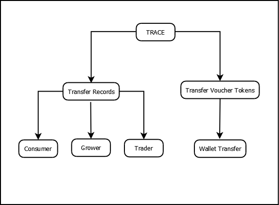

#Contents
1. WHAT IS TRACE? 
	- 1.1 FUNCTIONALITIES OF TRACE 
2. TRACE API REFERENCE 
	- 2.1. STEPS FOR SIGNUP 
	- 2.2. USER AUTHENTICATION API 
	- 2.3. TRANSFER RECORDS 
	- 2.4. TRANSFER FISHCOIN 
	- 2.5. SETTINGS 
		- A. PROFILE INFORMATION 
		- B. TRANSACTION LOG 
			- I. DEBIT TRANSACTION LOGS OF USER 
			- II. CREDIT TRANSACTION LOGS OF USER 
		- C. INVITES MANAGEMENT 
			- I. SEND AN INVITE 
			- II. ACCEPT AN INVITE 
			- III. REJECT AN INVITE 
			- IV. FETCH SENT INVITES 
			- V. RECEIVED INVITES 
	- 2.6 FIND YOUR TRANSACTIONS ON TEST NET 

**Introduction**
Fish and other sea food products are harvested, processed by farmers and then sold to local suppliers. They provide these to region suppliers who in turn sells it to the customers. But the industry is often unsustainable, illegal and inefficient.   
To tackle these problems, a system was developed to check traceability and quality maintenance using Blockchain technology. All the data was shared seamlessly using a Blockchain. A mobile + Web application was designed to capture data from fisherman. 
In this project we developed and integrated TRACE API which serves as the primary gateway to facilitate digital values transfer.

Benefits for client after developing and integrating TRACE system  
- Precise information about seafood product was available to end user.
- Exchange of digital currency from one person to another.
- Effective tracking of the seafood products in global supply chain.
- Reward mechanism for every user role in terms of tokens.
- Through the system the client witnessed a hike in record collection.

**1.	What is TRACE?** 
It is an application programming interface, enablesto open up applications’ data and functionality to external third-party developers and business partners. TRACE allows services and products to communicate with each other and leverage each other’s data and functionality through a documented interface. Developers don't need to know how an TRACE API is implemented; they can simply use the TRACE APIinterface to communicate with other products and services. 

- **1.1	Functionalities of TRACE** 
	There are three user roles involved in TRACE system namely Grower, Consumer, Trader. Users will be able to avail the features of application by signing into it. For registering new user, along with user details, industry role is a mandatory field. After successful sign up, transfer records are made visible to user as per industry role. All the registration and login details are stored on Firebase database.

  

  
  

	User roles like fisher and farmer can add new transfer record while trader can add linked records. Farmers/fisher will have to enter the product information along with their own profile information which was auto populated. In product information, unit id, harvest date, location, species and quantities are captured. To send this product, receiver's mobile number is required. The receiver will be able to check his newly received data with provision of accepting and rejecting the product. 
	If user rejects any product then all details of such product get erased from the system. For accepted product, certain number of tokens gets transferred to sender's account and the details are then written on public blockchain Stellar with the help of smart contract. All the transactional records are maintained on blockchain. 
	To utilize the received tokens, another functionality called recharge utility is provided. Because of this function farmers, Trader and fisherman are able to use those received utility tokens for various recharge services like mobile, TV, broadband, electricity and many more utility bill payments. 
 
**2. TRACEAPI reference** 
Welcome to the TRACE API reference.
This API serves as the primary gateway to facilitate digital values transfer through TRACE.
Links to access 
	-[TRACE Website](http://52.163.83.160:7771) 
	-[TRACE Firebase Swagger](http://52.163.83.160:7772/API-docs) 
	-[TRACE Blockchain Swagger](http://52.163.83.160:7773/API-docs/#/) 

- **2.1	Steps for Signup** 
1. Signup by [clicking here](http://52.163.83.160:7771)
2. User has to Sign up from portal using valid email address and select anyone of the three roles. (Fisher, Farmer, Trader).
3. A verification email will be sent to the registered email address
4. Verify the email addressreceived at the registered email address
5. Login once to activate your account and add the profile details.
 
- **2.2	User Authentication API** 
Once the initial signup and verification process is done, you can use this API to fetch the user details. UserID is the value that will be used to uniquely identify the user and also will be required as a base for all the user related operations. 

API: UserAuthentication 
Endpoint:cmxAPI/firebase/userAuthentication 
Request Body Parameters: 

Parameter | Data type | Required
----------|-----------|---------
email     |   String  |   Yes
password  |   String  |   Yes

Sample Request Body:{
  "email": "rem@yopmail.com",
  "password": "Abc@123"
}

- **2.3. Transfer Records** 
There are multiple API’s that can be consumed for fetching details of records, below is the list provided with it’s use, API end points and parameters.
	- **1. Fetching sent records** 
This API will fetch all the records that are sent by user to fisher, farmer, trader along with status of records. 
Endpoint:cmxAPI/firebase/getSentRecordsByUser 
Request Body Parameters: 

	Parameter | Data type | Required
	--------- |-----------|---------
	userId    |  String   | Yes

Sample Request Body:{
  "userId": "52QqKTpme1VAMZgsqSycLMhuTpd"
}

- **2. Fetching received records.** 
This API will fetch all the records that are received by user from fisher, farmer, trader along with status of records. 
Endpoint:cmxAPI/firebase/getReceivedRecordsByUser 
Request Body Parameters: 

	Parameter | Data type | Required
	--------- |-----------|---------
	userId    |  String   | Yes

Sample Request Body: {
  "userId": "52QqKTpme1VAMZgsqSycLMhuTpd"
}

- **3.Fetching country list.** 
Used to fetch all the countries with country code. 
Endpoint:cmxAPI/firebase/getCountryList 
Method:GET 

- **4.Get Major Fishing Area.** 
Used to fetch the Fishing Area for Fisher, Farmer 
Endpoint: cmxAPI/firebase/getFAOMajorFishingArea 
Method: GET 

- **5.Get Fishing gear.** 
Used to fetch different types of fishing gears available 
Endpoint:cmxAPI/firebase/getFishingGear 
Method:GET 

- **6.Get Margin Amount.** 
Marging amount for merchant transactions 
Endpoint:cmxAPI/firebase/getMarginAmount 
Method: GET 

- **7.Sending a record.** 
A user can send a record to Fisher Farmer or Trader. The request body will change as per the role of the sender. 
Endpoint:cmxAPI/firebase/getReceivedRecordsByUser 

Request Body: 
- a.Fisher: 

	Parameter | Data type | Required
	--------- | --------- | --------
	ArrivalPort | String | No
	DeparturePort | String | No
	DepartureDate | String | Yes
	ArrivalDate | String | Yes
	CultureUnitLocation | String | No
	CultureUnitID | String | No
	RecdRole | String | Yes
	Status | String | Yes
	SentUId | String | Yes
	RecdUId | String | No
	TxnStep | Integer | Yes
	TxnHash | String | Yes
	TxnLinkID | String | Yes
	AddAndLocOfFarm | String | Yes
	NameOfFarmAndCompany | String | Yes
	IsDeleted | String | Yes
	CreatedDate | String | Yes
	Species | String | Yes
	additionalInfo | Array | No
	UserName | String | Yes
	SenderName | String | Yes
	LicenseAndPermitNumber | String | Yes
	NameOfVessel | String | Yes
	CountryOfVesselRegistration | String | Yes
	FAOMajorFishingArea | String | Yes
	FishingGear | String | Yes
	VesselID | String | Yes
	isRead | Boolean | Yes
	FishcoinAssets | String | Yes
	ReceiverName | String | Yes

Example.
{
	"ArrivalPort": "LAS",
	"DeparturePort": "LAX",
	"DepartureDate": "2021-11-03",
	"ArrivalDate": "2021-11-03",
	"CultureUnitLocation": "",
	"CultureUnitID": "",
	"RecdRole": "Fisher",
	"Status": "Log",
	"SentUId": "rOePqdKurLRY3pzHE6rOSlcgsDH3",
	"RecdUId": "",
	"TxnStep": 0,
	"TxnHash": "",
	"TxnLinkID": "",
	"AddAndLocOfFarm": "",
	"NameOfFarmAndCompany": "",
	"IsDeleted": false,
	"CreatedDate": "11 03 2021 17:55:48",
	"Species": [
		{
			"SpeciesId": "r1uk9p",
			"SpeciesName": "Anchovy - European",
			"SpeciesQty": 1,
			"ParentID": "",
			"LinkID": "",
			"AvailableQty": 1,
			"AdditionalInfo": [
				{
					"name": "",
					"value": ""
				}
			],
			"otherSpec": ""
		}
	],
	"additionalInfo": [
		{
			"name": "",
			"value": ""
		}
	],
	"UserName": "required",
	"SenderName": "Fisher UAT",
	"LicenseAndPermitNumber": "uat1234567",
	"NameOfVessel": "uat",
	"CountryOfVesselRegistration": "India",
	"FAOMajorFishingArea": "Area 27 (Atlantic, Northeast)",
	"FishingGear": "Handlines and hand-operated pole-and-line",
	"VesselID": "uat1234567",
	"isRead": false,
	"FishcoinAssets": 1
}

- b.Farmer:
	Parameter | Data type | Required/Default
	--------- | --------- | --------
	ArrivalPort | String | No
	DeparturePort | String | No
	DepartureDate | String | Yes- NULL
	CultureUnitLocation | String | Yes
	CultureUnitID | String | Yes
	ArrivalDate | String | Yes
	RecdRole | String | Yes
	Status | String | Yes
	SentUId | String | Yes
	RecdUId | String | No
	TxnStep | Integer | Yes
	TxnHash | String | No
	TxnLinkID | String | No
	IsDeleted | Boolean | Yes- false
	isRead | Boolean | Yes- false
	CreatedDate | String | Yes
	Species | String | Yes
	additionalInfo | Object | Yes
	UserName | String | Yes
	SenderName | String | Yes
	LicenseAndPermitNumber | String | Yes
	Country | String | Yes
	NameOfFarmAndCompany | String | Yes
	AddAndLocOfFarm | String | Yes
	FishcoinAssets | String | Yes

Example- {"ArrivalPort":"","DeparturePort":"","DepartureDate":null,"CultureUnitLocation":"EWR","CultureUnitID":"NSK666","ArrivalDate":"2021-11-10T12:16:56.629+05:30","RecdRole":"Farmer","Status":"Log","SentUId":"52QqKTpme1VAMZgsqSycLMhuTpd2","RecdUId":"","TxnStep":0,"TxnHash":"","TxnLinkID":"","IsDeleted":false,"isRead":false,"CreatedDate":"11 10 2021 12:18:13","Species":[{"SpeciesId":"kv7gl","SpeciesName":"Flounder - Olive","SpeciesQty":1,"ParentID":"","LinkID":"","AvailableQty":1,"AdditionalInfo":[{"name":"name1","value":"value1"}],"otherSpec":""}],"additionalInfo":[{"name":"ext","value":"extvalue"}],"UserName":"Remith UAT","SenderName":"Remith UAT","LicenseAndPermitNumber":"ABZ897654","Country":"India","NameOfFarmAndCompany":"Winjit","AddAndLocOfFarm":"Satpur","FishcoinAssets":1}

- c. Trader: 

	Parameter | Data type | Required/Default
	--------- | --------- | --------
	ArrivalPort | String | No
	DeparturePort | String | N0
	DepartureDate | String | Yes-Null
	ArrivalDate | String | Yes
	CultureUnitLocation | String | No
	CultureUnitID | String | No
	RecdRole | String | Yes
	Status | String | Yes
	SentUId | String | Yes
	RecdUId | String | No
	TxnStep | Integer | Yes
	TxnHash | String | No
	TxnLinkID | String | No
	IsDeleted | Boolean | Yes-False
	IsRead | Boolean | Yes-False
	CreatedDate | String | Yes
	Species | String | Yes
	additionalInfo | Array | No
	UserName | String | Yes
	SenderName | String | Yes
	LicenseAndPermitNumber | String | Yes
	Country | String | Yes
	NameOfFarmAndCompany | String | Yes
	AddAndLocOfFarm | String | Yes
	FishcoinAssets | String | Yes

Example:
	{"ArrivalPort":"","DeparturePort":"","DepartureDate":null,"CultureUnitLocation":"LAX","CultureUnitID":"NSK777","ArrivalDate":"2021-11-10T12:26:51.874+05:30","RecdRole":"Farmer","Status":"Log","SentUId":"52QqKTpme1VAMZgsqSycLMhuTpd2","RecdUId":"","TxnStep":0,"TxnHash":"","TxnLinkID":"","IsDeleted":false,"isRead":false,"CreatedDate":"11 10 2021 12:27:44","Species":[{"SpeciesId":"se212e","SpeciesName":"Carp - Black","SpeciesQty":1,"ParentID":"","LinkID":"","AvailableQty":1,"AdditionalInfo":[{"name":"name1","value":"value1"}],"otherSpec":""}],"additionalInfo":[{"name":"aname1","value":"avalue1"}],"UserName":"Remith UAT","SenderName":"Remith UAT","LicenseAndPermitNumber":"ABZ897654","Country":"India","NameOfFarmAndCompany":"Winjit","AddAndLocOfFarm":"Satpur","FishcoinAssets":5}

**NOTE: **
- Status can be - log, accepted, pending
- Species and additional info are common for Fisher, Farmer and Trader and a sample Parameters would look like below.
- i. additionalInfo :

	Parameter | Data type | Required/Default
	--------- | --------- | --------
	name | String | Yes 
	value | String | Yes
	
- ii. Species:
	
	Parameter | Data type | Required/Default
	--------- | --------- | --------
	SpeciesId | String | Yes 
	SpeciesName | String | Yes
	SpeciesQty | String | Yes
	ParentID | String | No
	LinkID | String | No
	AvailableQty | String | Yes
	AdditionalInfo | Object | Yes
	otherSpec | String | No
	
**8. Sending a linked record** 
  A user can send his received records to a fisher, farmer or trader. 
API:cmxAPI/firebase/addTxnDetails 
Request Body:   

Parameter | Data type | Required/Default
--------- | --------- | --------
isRead | Boolean | Yes– false
ArrivalPort | String | No
DeparturePort | String | No
DepartureDate | String | Yes-NULL
RecdRole | String | No
SendUId | String | Yes
RecdUId | String | Yes
Status | String | Yes
TxnStep | Integer | Yes
TxnHash | String | No
TxnLinkID | String | No
IsDeleted | Boolean | Yes-false
Species | String | Yes
additionalInfo | Object | Yes
UserName | String | Yes
LicenseAndPermitNumber | String | Yes
AddAndLocOfFarm | String | Yes
FishcoinAssets | String | Yes
SenderName | String | Yes
ReceiverName | String | Yes

Sample Request Body : {
  "isRead": false,
  "ArrivalPort": "",
  "DeparturePort": "",
  "DepartureDate": null,
  "CultureUnitLocation": "",
  "CultureUnitID": "",
  "CreatedDate": "11 10 2021 12:49:32",
  "ArrivalDate": "2021-11-10",
  "RecdRole": "Trader",
  "Status": "Pending",
  "SentUId": "52QqKTpme1VAMZgsqSycLMhuTpd2",
  "RecdUId": "rOePqdKurLRY3pzHE6rOSlcgsDH3",
  "TxnStep": 1,
  "TxnHash": "",
  "TxnLinkID": "",
  "IsDeleted": false,
  "Species": [
      {
        "SpeciesId": "ovh9vk",
        "SpeciesName": "Anchovy - Japanese",
        "SpeciesQty": 10,
        "ParentID": "-MnQQfQOplZhlD0qBtY6",
        "LinkID": "-MnQQfmN9g2PJgccGxoQ",
        "AvailableQty": 10,
        "AdditionalInfo": [
          {
            "name": "",
            "value": ""
          }
        ]
      },
      {
        "SpeciesId": "1xukcb",
        "SpeciesName": "Anchovy - European",
        "SpeciesQty": 10,
        "ParentID": "-MnQWI1UfZejCjfpmIF3",
        "LinkID": "-MnQWIQLuMGXJm5ljBQd",
        "AvailableQty": 10,
        "AdditionalInfo": [
          {
            "name": "",
            "value": ""
          }
        ]
      }
  ],
  "additionalInfo": [
    {
      "name": "name1",
      "value": "value1"
    }
  ],
  "UserName": "Remith UAT",
  "LicenseAndPermitNumber": "NSK987",
  "AddAndLocOfFarm": "Satpur",
  "FishcoinAssets": "10",
  "SenderName": "Remith UAT",
  "ReceiverName": "Fisher UAT"
}

**9. Fetch record details** 
  Get transaction details using transaction key 
API:cmxAPI/firebase/getTxnbyKey 
Request Body: 

Parameter | Data type | Required/Default
--------- | --------- | --------
Key | String | Yes

Sample Request Body :      {
  "key": "-MmvS-YlNqUQV76YSNOV"
}

**2.4 Transfer Fishcoin** 
- **a. Get Wallet balance** 
To fetch Stellar wallet balance 
API: /AccountDetails 
Request Body: 

	Parameter | Data type | Required/Default
	--------- | --------- | --------
	accountId | String | Yes

Sample Request Body: {
  "accountId":"GDC33CQDL7U3YI4MI2MFLRM7JP62TXDKBIWI4UXH2H27BOCAMJZSZZN3" 
}

- **b. Transfer fishcoin** 
This API is used to transfer Fish assets from one account to another 
API: /transferFishAssets 
Request Body: 

	Parameter | Data type | Required/Default
	--------- | --------- | --------
	srcAcct | String | Yes
	srcSeed | String | Yes
	srcUserID | String | Yes
	destAcct | String | Yes
	destSeed | String | Yes
	destUserID | String | Yes
	Amount | float | Yes
	
Sample Request Body:
{
  "srcAcct":"GATSU64WOJDOGUMLKZP5FUJL32QM6WX5PLH4YRKK3ROWMCFPZ7RCKPI2",
  "srcSeed":"U2FsdGVkX1+8FNQyvOaMCZvl2R1raM6/SHLfTiUvwWeiOsV7NqRe8i3C6Joei1DTrK7DcbALVjk3d90FT+YMwUYFp2bEmyrC9Gf7SAmOxXM=",
  "srcUserID":"Vkb6O6ZfLyQS1cLRbcnXJc4QnMp1",
  "destAcct":"GAVAUZFXKZMZMXS3CTZF34AX4IHQMEYJK55CNJ4M75MV25LDTADXJUJQ",
  "destSeed":"U2FsdGVkX1+nBSNFrJPVu17q7IlIVcR4ub7wNr7q7BXfnsAUSlY27EiW3rqGpIeiiyDOdbBzmfZsHWsughR/CxlvurGPWGS7YwduuiK9keM=",
  "destUserID": "52QqKTpme1VAMZgsqSycLMhuTpd2",
  "amount": 0.1
}

**c.Transfer Fish Assets to Merchant Account** 
 This API is used to transfer Fish assets to merchant account from user account 
API:/transferFishAssetsToMerchant 
Request Body :  

Parameter | Data type | Required/Default
--------- | --------- | --------
srcAcct | String | Yes
srcSeed | String | Yes
srcUserID | String | Yes
Amount | Float | Yes
feesAmount | Float | Yes
burnAmount | Integer | Yes

Sample Request Body: 
{
  "srcAcct":"GATSU64WOJDOGUMLKZP5FUJL32QM6WX5PLH4YRKK3ROWMCFPZ7RCKPI2",
  "srcSeed":"U2FsdGVkX1+8FNQyvOaMCZvl2R1raM6/SHLfTiUvwWeiOsV7NqRe8i3C6Joei1DTrK7DcbALVjk3d90FT+YMwUYFp2bEmyrC9Gf7SAmOxXM=",
  "srcUserID": "Vkb6O6ZfLyQS1cLRbcnXJc4QnMp1",
  "amount": "0.005000000000000001",
  "feesAmount": "0.005000000000000001",
  "burnAmount": "0"
}

**d.Transfer Fish Assets from merchant Account** 
 This API is used to transfer Fish assets from merchant account to another  
API:/transferFishAssetsFromMerchant  
Request Body:  

Parameter | Data type | Required/Default
--------- | --------- | --------
destAcct | String | Yes
destSeed | String | Yes
destUserID | String | Yes
Amount | float | Yes

Sample Request Body: {
  "destAcct":"GATSU64WOJDOGUMLKZP5FUJL32QM6WX5PLH4YRKK3ROWMCFPZ7RCKPI2",
  "destSeed":"U2FsdGVkX1+8FNQyvOaMCZvl2R1raM6/SHLfTiUvwWeiOsV7NqRe8i3C6Joei1DTrK7DcbALVjk3d90FT+YMwUYFp2bEmyrC9Gf7SAmOxXM=",
  "destUserID": "Vkb6O6ZfLyQS1cLRbcnXJc4QnMp1",
  "amount": "5"
}

**e.Write Data on Blockchain** 
 This API is used to write IPFS hash on the stellar blockchain, it returns the Stellar Transaction Hash 
API: /writeDataOnBlockchain 
Request Body: 

Parameter | Data type | Required/Default
--------- | --------- | --------
jsonData | String | Yes
destAcct | String | Yes
destSeed | String | Yes
destUserID | String | Yes
srcAcct | String | Yes
srcSeed | String | Yes
srcUserID | String | Yes
amount | float | Yes

Sample Request Body: {
  "jsonData":"{\"AddAndLocOfFarm\":\"Satpur\",\"ArrivalDate\":\"2021-10-29T12:04:23.242+05:30\",\"ArrivalPort\":\"\",\"Country\":\"India\",\"CreatedDate\":\"10 29 2021 12:04:54\",\"CultureUnitID\":\"axa\",\"CultureUnitLocation\":\"EWR\",\"DeparturePort\":\"\",\"FishcoinAssets\":1,\"IsDeleted\":false,\"LicenseAndPermitNumber\":\"ABZ897654\",\"NameOfFarmAndCompany\":\"Winjit\",\"RecdRole\":\"Farmer\",\"RecdUId\":\"Vkb6O6ZfLyQS1cLRbcnXJc4QnMp1\",\"ReceiverName\":\"Remith Test\",\"SenderName\":\"Remith UAT\",\"SentUId\":\"52QqKTpme1VAMZgsqSycLMhuTpd2\",\"Species\":[{\"AdditionalInfo\":[{\"name\":\"\",\"value\":\"\"}],\"AvailableQty\":1,\"LinkID\":\"\",\"ParentID\":\"-Mn9kXxpm2Ef9MSk2CM3\",\"SpeciesId\":\"tt4ymk\",\"SpeciesName\":\"Carp - Common\",\"SpeciesQty\":1,\"otherSpec\":\"\"}],\"Status\":\"Pending\",\"TxnHash\":\"\",\"TxnLinkID\":\"-Mn9kXxpm2Ef9MSk2CM3\",\"TxnStep\":0,\"UserName\":\"Remith UAT\",\"additionalInfo\":[{\"name\":\"\",\"value\":\"\"}],\"isRead\":false,\"key\":\"-Mn9kYH_aUOenodB3Zu7\"}",
  "destAcct": "GAVAUZFXKZMZMXS3CTZF34AX4IHQMEYJK55CNJ4M75MV25LDTADXJUJQ",
  "destSeed":"U2FsdGVkX1+nBSNFrJPVu17q7IlIVcR4ub7wNr7q7BXfnsAUSlY27EiW3rqGpIeiiyDOdbBzmfZsHWsughR/CxlvurGPWGS7YwduuiK9keM=",
  "destUserID":"52QqKTpme1VAMZgsqSycLMhuTpd2",
  "srcAcct":"GATSU64WOJDOGUMLKZP5FUJL32QM6WX5PLH4YRKK3ROWMCFPZ7RCKPI2",
  "srcSeed":"U2FsdGVkX1+8FNQyvOaMCZvl2R1raM6/SHLfTiUvwWeiOsV7NqRe8i3C6Joei1DTrK7DcbALVjk3d90FT+YMwUYFp2bEmyrC9Gf7SAmOxXM=",
  "srcUserID": "Vkb6O6ZfLyQS1cLRbcnXJc4QnMp1",
  "amount": 1
}

**2.5. Settings** 

**a. Profile information** 
Fetch user details using userID. 
API:/cmxAPI/firebase/getCurrentUserAccotDetailsByUId 
Request Body: 

Parameter | Data type | Required/Default
--------- | --------- | --------
userId | String | Yes

Sample Request Body : {
  "userId": "52QqKTpme1VAMZgsqSycLMhuTpd"
}

**b. Transaction Log** 

**i. Debit transaction logs of user** 
 Fetch user debit logs using userID. 
API:/cmxAPI/firebase/getDebitTxnLogListByUserID 
Request Body: 

Parameter | Data type | Required/Default
--------- | --------- | --------
userId | String | Yes

Sample Request Body : {
  "userId": "52QqKTpme1VAMZgsqSycLMhuTpd"
}

**ii. Credit transaction logs of user** 
Fetch user credit logs using userID. 
API: /cmxAPI/firebase/getCreditTxnLogListByUserID 
Request Body: 

Parameter | Data type | Required/Default
--------- | --------- | --------
userId | String | Yes 

Sample Request Body : {
  "userId": "52QqKTpme1VAMZgsqSycLMhuTpd"
}

**c. Invites Management** 

**i. Send an Invite** 
 Send a connection request to a registered TRACE user. 
API: /cmxAPI/firebase/addInvite 
Request Body:  

Parameter | Data type | Required/Default
--------- | --------- | --------
countryCode | String | Yes
sLoginId | String | Yes
rLoginId | String | Yes
Accepted | String | Yes
CreatedDate | String | Yes

Note: sLoginId : Logged in user login ID/email 
rLoginId :LoginID/ email of the user who the invite is supposed to be for. 
accepted: Status can be a string ‘accepted’ or ‘pending’, default to be sent as pending.  

Sample Request Body : 
 {
 "countryCode": "+91",
  "sLoginId": "remithr@yopmail.com",
  "rLoginId": "trader@yopmail.com",
  "accepted": "pending",
  "senderId": "52QqKTpme1VAMZgsqSycLMhuTpd2",
  "senderName": "Remith UAT",
  "senderRole": "Farmer",
  "senderImg": "https://firebasestorage.googleAPIs.com/v0/b/eachmile-uat.appspot.com/o/img-52QqKTpme1VAMZgsqSycLMhuTpd2?alt=media&token=45abd43b-e53b-41c2-9edd-5749f0baaddf",
  "receiverId": "5myEE4xhbyaLOGyF63gJH3GCFsE3",
  "receiverName": "Trader UAT",
  "CreatedDate": "11 10 2021 18:39:32",
  "receiverRole": "Trader",
  "receiverImg": " ",
  "FcmToken": ""
}

**ii. Accept an invite** 
Once user accepts a connection request, we can update the status and show connections accordingly. 
API:/cmxAPI/firebase/updateInviteLog 
Request Body: 

Parameter | Data type | Required/Default
--------- | --------- | --------
Accepted	String	Yes 
Key	String	Yes

Sample Request Body :
  { 
   "accepted": "accepted",
    "key": "-MnZRBqajkQBDc_XV-7C"
  }

**iii. Reject an Invite** 
Will reject the connection request or an accepted connection and delete the log from user connections. 
API:/cmxAPI/firebase/deleteInviteLog 
Request Body: 

Parameter | Data type | Required/Default
--------- | --------- | ----------------
Key | String | Yes

Sample Request Body : { 
 "key": "-MnZRBqajkQBDc_XV-7C"
}

**iv. Fetch Sent Invites** 
Fetch all the invites sent by the user. Using the status as flag we can show the connections that are pending to accept and existing connection. 
API:/cmxAPI/firebase/getInvitesBySenderID 
Request Body: 

Parameter | Data type | Required/Default
--------- | --------- | ----------------
userId | String | Yes

Sample Request Body : {
  "userId": "52QqKTpme1VAMZgsqSycLMhuTpd"
}

**v. Received Invites** 
 Fetch all the invites received by the user. Using the status as flag we can show the connections that are pending to accept and existing connection. 
API:/cmxAPI/firebase/getInvitesByReceiverID 
Request Body:

Parameter | Data type | Required/Default
--------- | --------- | ----------------
userId | String | Yes 

Sample Request Body: {
  "userId": "52QqKTpme1VAMZgsqSycLMhuTpd"
}

**2.6 Find your transactions on test net.** 
- a.Fetch the transaction hash from the transaction and go to Stellar test net URL to find details. 
	http://testnet.stellarchain.io/tx/txn_hash_here 
Example: 
	hash= ffa62016e1c20e5042ca59c2979545e20f6fa02de36824286515e12dd5e6abf9 
Then below is the blockchain tracking URL- 
	http://testnet.stellarchain.io/tx/ffa62016e1c20e5042ca59c2979545e20f6fa02de36824286515e12dd5e6abf9 
